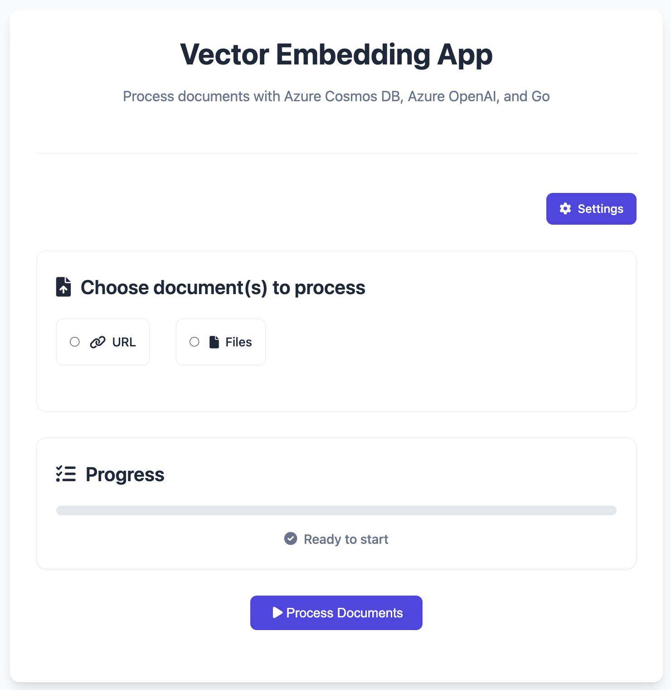
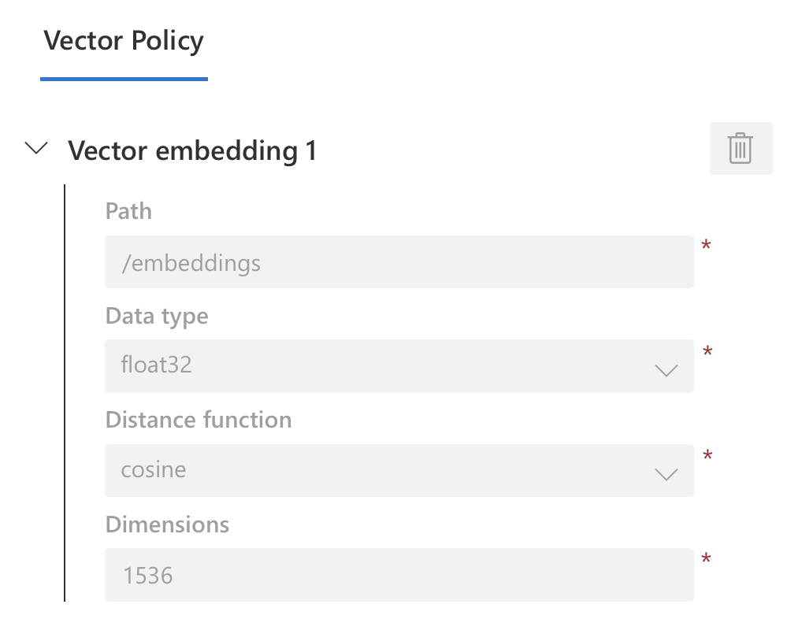
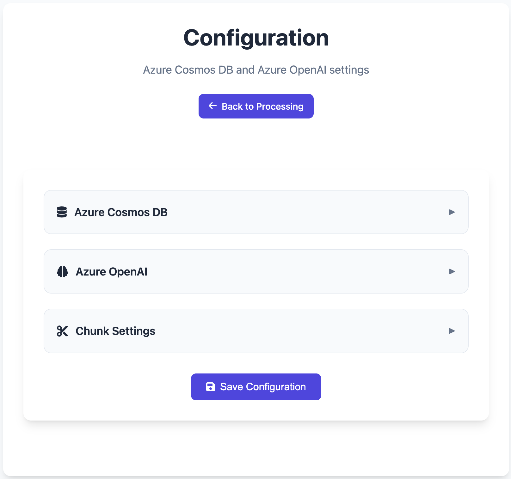
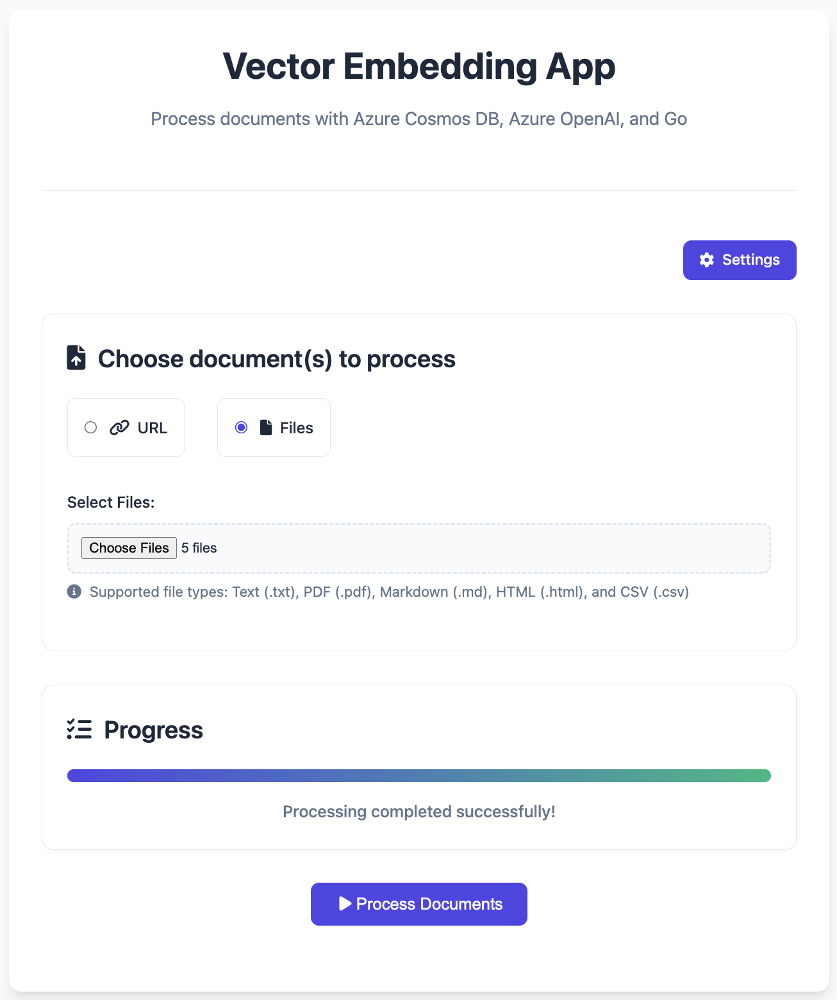

# Vector embeddings made easy with Go, Azure Cosmos DB, and OpenAI

This is a simple web application using which you can quickly generate vector embeddings for various document types and store them directly into [Azure Cosmos DB](https://learn.microsoft.com/en-us/azure/cosmos-db/nosql/vector-search). Once stored, this data can be leveraged by other applications for tasks like vector search, part of a Retrieval-Augmented Generation (RAG) workflow, and more.



The application is built using Go using the SDKs for Azure Cosmos DB ([`azcosmos`](https://pkg.go.dev/github.com/Azure/azure-sdk-for-go/sdk/data/azcosmos)) and Azure OpenAI ([`azopenai`](https://pkg.go.dev/github.com/Azure/azure-sdk-for-go/sdk/ai/azopenai)). It also utilizes the [`langchaingo`](https://github.com/tmc/langchaingo) library for document loading and text splitting. The frontend is a simple HTML, CSS, and JavaScript embedded directly in the Go application.

- Supports any text content, including file types such as `.txt`, `.pdf`, `.md`, `.html`, and `.csv`.
- You can directly reference a file using URLs ([example](https://raw.githubusercontent.com/MicrosoftDocs/azure-databases-docs/refs/heads/main/articles/cosmos-db/nosql/vector-search.md)) or use multiple local files at once.
- Easily configure Azure Cosmos DB (endpoint, database, container) and Azure OpenAI (endpoint and embedding model) details.
- No need to use service keys since the application supports service principals via [DefaultAzureCredential](https://learn.microsoft.com/en-us/azure/developer/go/sdk/authentication/authentication-overview#defaultazurecredential).
- Also stores source file name in the `metadata` attribute

## Prerequisites

Complete these steps before running the application.

### Setup Azure Cosmos DB

[Create an Azure Cosmos DB for NoSQL account](https://learn.microsoft.com/en-us/azure/cosmos-db/nosql/how-to-create-account?tabs=azure-cli). [Enable the vector indexing and search feature](https://learn.microsoft.com/en-us/azure/cosmos-db/nosql/vector-search) - this is a one-time operation.

Create a database and collection (use partition key `/id` for this application). Also, configure a [vector policy](https://learn.microsoft.com/en-us/azure/cosmos-db/nosql/vector-search#container-vector-policies) for the container with the right path, distance function, etc.



### Azure OpenAI

[Create an Azure OpenAI Service](https://learn.microsoft.com/en-us/azure/ai-services/openai/how-to/create-resource?pivots=web-portal#create-a-resource) resource. Azure OpenAI Service provides access to OpenAI's models including the GPT-4o, GPT-4o mini (and more), as well as embedding models. [Deploy an embedding model](https://learn.microsoft.com/en-us/azure/ai-services/openai/how-to/create-resource?pivots=web-portal#deploy-a-model) of your choice using the Azure AI Foundry portal (for example, I used the `text-embedding-3-small` model).

### RBAC setup

Using RBAC is a good practice as it allows us to use eliminate hardcoding API keys and secrets in the code. The service principal that you use for the app needs to have the right permissions for Azure Cosmos DB and Azure OpenAI.

#### Create service principal

Execute the following command to create a service principal:

```bash
az ad sp create-for-rbac
```

> You should see an output similar to this. Note down the system-assigned password as you can't retrieve it again

```json
{
  "appId": "<the app ID>",
  "displayName": "<the name>",
  "password": "<the client secret>",
  "tenant": "<tenant ID>"
}
```

Get the principal ID using the following command:

```bash
export PRINCIPAL_ID=$(az ad sp show --id <enter the appID from the command output> --query "id" -o tsv)
```

#### Assign Azure OpenAI role

```bash
export AZURE_OPENAI_RESOURCE_NAME=<your-openai-resource-name>
export RG_NAME=<your-resource-group-name>
```

Get the resource ID of the Azure OpenAI resource and assign the `Cognitive Services OpenAI Contributor` role to the service principal:

```bash
export AZURE_OPENAI_ID=$(az cognitiveservices account show --name $AZURE_OPENAI_RESOURCE_NAME --resource-group $RG_NAME --query "id" -o tsv)

az role assignment create --assignee $PRINCIPAL_ID --role "Cognitive Services OpenAI Contributor" --scope $AZURE_OPENAI_ID
```

#### Assign Azure Cosmos DB role

```bash
export COSMOSDB_ACCOUNT=<your-cosmosdb-account-name>
export COSMOSDB_RG_NAME=<your-resource-group-name>
```

Get the resource ID of the Azure Cosmos DB account and assign the `Cosmos DB Built-in Data Contributor` role to the service principal:

```bash
export COSMOSDB_ACC_ID=$(az cosmosdb show --name $COSMOSDB_ACCOUNT --resource-group $COSMOSDB_RG_NAME --query "id" -o tsv)

az cosmosdb sql role assignment create -n "Cosmos DB Built-in Data Contributor" -g $COSMOSDB_RG_NAME -a $COSMOSDB_ACCOUNT -p $PRINCIPAL_ID --scope $COSMOSDB_ACC_ID
```

## Run the web application

> Make sure you have Go installed on your machine. You can download it from [here](https://go.dev/dl/).

Clone this GitHub repository:

```bash
git clone https://github.com/abhirockzz/cosmosdb_openai_vector_embedding_webapp_golang
cd cosmosdb_openai_vector_embedding_webapp_golang

go mod tidy
```

Set the service principal credentials as environment variables, and run the application:

```bash
export AZURE_TENANT_ID="<tenant value from the command output>"
export AZURE_CLIENT_ID="<value of appID from the command output>"
export AZURE_CLIENT_SECRET="<value of password from the command output>"

go run main.go
```

You will be asked to configure the app - enter values for Azure Cosmos DB endpoint, Azure OpenAI endpoint, and more.



Once that's done, go ahead and enter a URL for a file, or choose any text file(s) from your local machine:



As part of the processing, the vector embeddings will be generated and stored in Azure Cosmos DB. The application will show you the progress as well.

Once the processing finishes, verify the same in Azure Cosmsos DB. For example, if you chose to process the [following markdown file](https://raw.githubusercontent.com/MicrosoftDocs/azure-databases-docs/refs/heads/main/articles/cosmos-db/nosql/vector-search.md) URL, run this query to see the results:

```sql
SELECT c.id FROM c WHERE CONTAINS(c.metadata.source, "vector-search.md")
```

> Now you can execute vector queries using the Azure Cosmos DB SDKs. For example, refer to the **Vector/Similarity search** section [in this blog](https://dev.to/abhirockzz/get-started-with-vector-search-in-azure-cosmos-db-15dk).

## Troubleshooting

If you see an error similar to `Error: HTTP error! status: 500, message: Failed to process`, the issue could be related to:

- RBAC - make sure the service principal has the right permissions for Azure Cosmos DB and Azure OpenAI
- You entered an incorrect database, container, or Azure OpenAI model name
- Either of Cosmos DB or Azure OpenAI endpoints are incorrect
